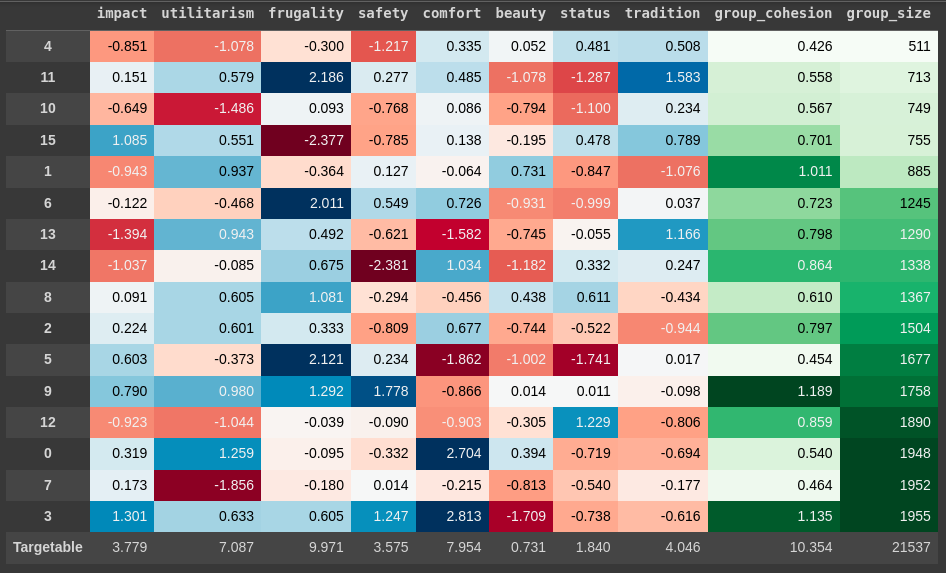

# A Revenue Operations Game

Simulated customer segments have a realistic distribution of values and market size. 

These segments share values across many dimensions, but some are more cohesive (thus easy to target) than others.

Research, collect data, interview, and run campaigns to your way to a stellar ROI. 

At the end of the simulation, you will see everything you wish you had seen sooner.

